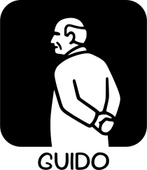

<p align="center">
  
  
</p>

# Guido

**A reactive Rust GUI library for Wayland layer shell widgets**


Guido is a GPU-accelerated GUI library built with Rust and wgpu, designed specifically for creating Wayland layer shell applications like status bars, panels, overlays, and desktop widgets.

## Key Features

- **Reactive System** - Fine-grained reactivity inspired by SolidJS with signals, computed values, and effects
- **GPU Rendering** - Hardware-accelerated rendering using wgpu with SDF-based shapes for crisp anti-aliasing
- **Wayland Layer Shell** - Native support for layer shell positioning, anchoring, and exclusive zones
- **State Layer API** - Declarative hover/pressed states with automatic animations and ripple effects
- **Transform System** - Translate, rotate, and scale widgets with spring physics animations
- **Composable Widgets** - Build complex UIs from simple, composable primitives
- **Image Widget** - Display PNG, JPEG, WebP, and SVG images with GPU texture caching
- **Scrollable Containers** - Vertical and horizontal scrolling with customizable scrollbars

## Quick Example

```rust
use guido::prelude::*;

fn main() {
    let count = create_signal(0);

    let view = container()
        .padding(16.0)
        .background(Color::rgb(0.2, 0.2, 0.3))
        .corner_radius(8.0)
        .hover_state(|s| s.lighter(0.1))
        .pressed_state(|s| s.ripple())
        .on_click(move || count.update(|c| *c += 1))
        .child(text(move || format!("Clicked {} times", count.get())));

    App::new()
        .width(300)
        .height(100)
        .run(view);
}
```

## What Can You Build?

Guido is ideal for:

- **Status bars** - System information displays anchored to screen edges
- **Panels** - Application launchers and taskbars
- **Notifications** - Overlay popups and alerts
- **Desktop widgets** - Clocks, system monitors, media controls
- **Layer shell utilities** - Any Wayland layer shell application

## Platform Support

Currently, Guido supports **Wayland** on Linux with layer shell protocol. The library uses:
- `wgpu` for GPU-accelerated rendering
- `smithay-client-toolkit` for Wayland protocol handling
- `calloop` for event loop integration
- `glyphon` for text rendering

## Getting Started

Ready to build your first Guido application? Head to the [Installation](getting-started/installation.md) guide to set up your development environment.
