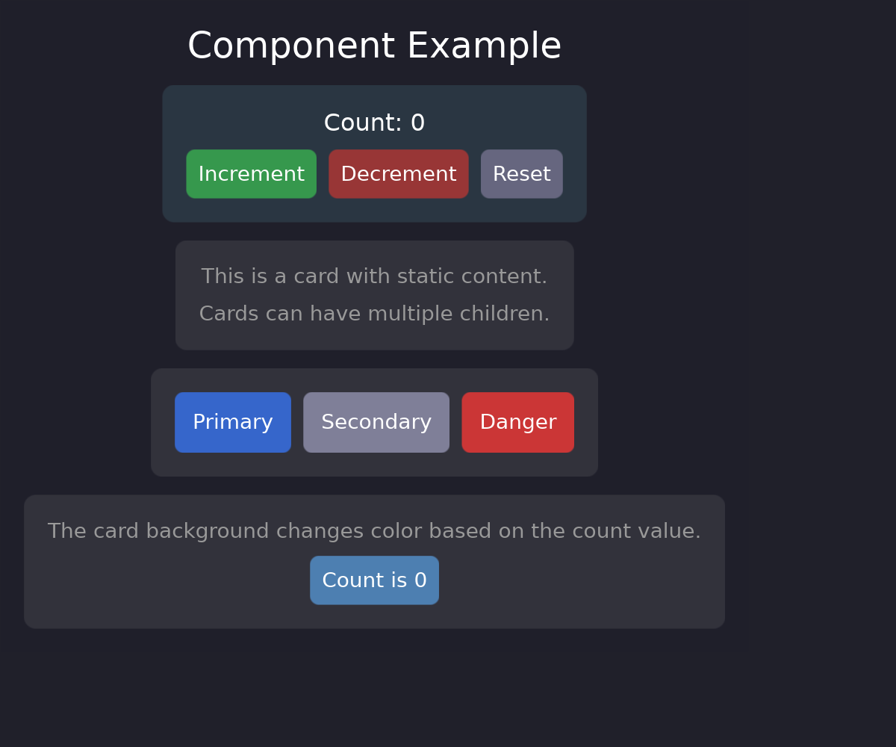

# Creating Components

The `#[component]` macro creates reusable widgets with props, callbacks, and children.



## Basic Component

```rust
use guido::prelude::*;

#[component]
pub struct Button {
    #[prop]
    label: String,
}

impl Button {
    fn render(&self) -> impl Widget {
        container()
            .padding(12.0)
            .background(Color::rgb(0.3, 0.5, 0.8))
            .corner_radius(6.0)
            .hover_state(|s| s.lighter(0.1))
            .pressed_state(|s| s.ripple())
            .child(text(self.label.clone()).color(Color::WHITE))
    }
}
```

Use the component with the auto-generated builder:

```rust
button().label("Click me")
```

## Props

### Required Props

```rust
#[prop]
label: String,
```

Must be provided when creating the component:

```rust
button().label("Required")
```

### Props with Defaults

```rust
#[prop(default = "Color::rgb(0.3, 0.3, 0.4)")]
background: Color,

#[prop(default = "8.0")]
padding: f32,
```

Optional - uses default if not specified:

```rust
button().label("Uses defaults")
button().label("Custom").background(Color::RED).padding(16.0)
```

### Callback Props

```rust
#[prop(callback)]
on_click: (),
```

Provide closures for events:

```rust
button()
    .label("Click me")
    .on_click(|| println!("Clicked!"))
```

In render, use `on_click_option` for optional callbacks:

```rust
.on_click_option(self.on_click.clone())
```

## Accessing Props

In the `render` method:

```rust
impl Button {
    fn render(&self) -> impl Widget {
        container()
            .padding(self.padding.get())      // Use .get() for value props
            .background(self.background.clone())  // Clone for reactive props
            .child(text(self.label.clone()))
    }
}
```

## Components with Children

```rust
#[component]
pub struct Card {
    #[prop]
    title: String,
    #[prop(children)]
    children: (),
}

impl Card {
    fn render(&self) -> impl Widget {
        container()
            .padding(16.0)
            .background(Color::rgb(0.18, 0.18, 0.22))
            .corner_radius(8.0)
            .layout(Flex::column().spacing(8.0))
            .child(text(self.title.clone()).font_size(18.0).color(Color::WHITE))
            .children_source(self.take_children())
    }
}
```

Use with child/children methods:

```rust
card()
    .title("My Card")
    .child(text("First child"))
    .child(text("Second child"))
```

## Reactive Props

Props accept signals and closures:

```rust
let count = create_signal(0);

button()
    .label(move || format!("Count: {}", count.get()))
    .background(move || {
        if count.get() > 5 {
            Color::rgb(0.3, 0.8, 0.3)
        } else {
            Color::rgb(0.3, 0.5, 0.8)
        }
    })
```

## Complete Example

```rust
use guido::prelude::*;

#[component]
pub struct Button {
    #[prop]
    label: String,
    #[prop(default = "Color::rgb(0.3, 0.3, 0.4)")]
    background: Color,
    #[prop(default = "8.0")]
    padding: f32,
    #[prop(callback)]
    on_click: (),
}

impl Button {
    fn render(&self) -> impl Widget {
        container()
            .padding(self.padding.get())
            .background(self.background.clone())
            .corner_radius(6.0)
            .hover_state(|s| s.lighter(0.1))
            .pressed_state(|s| s.ripple())
            .on_click_option(self.on_click.clone())
            .child(text(self.label.clone()).color(Color::WHITE))
    }
}

#[component]
pub struct Card {
    #[prop]
    title: String,
    #[prop(default = "Color::rgb(0.18, 0.18, 0.22)")]
    background: Color,
    #[prop(children)]
    children: (),
}

impl Card {
    fn render(&self) -> impl Widget {
        container()
            .padding(16.0)
            .background(self.background.get())
            .corner_radius(8.0)
            .layout(Flex::column().spacing(8.0))
            .child(text(self.title.clone()).font_size(18.0).color(Color::WHITE))
            .children_source(self.take_children())
    }
}

fn main() {
    let count = create_signal(0);

    let view = container()
        .padding(16.0)
        .layout(Flex::column().spacing(12.0))
        .child(
            card()
                .title("Counter")
                .child(text(move || format!("Count: {}", count.get())).color(Color::WHITE))
                .child(
                    container()
                        .layout(Flex::row().spacing(8.0))
                        .child(button().label("Increment").on_click(move || count.update(|c| *c += 1)))
                        .child(button().label("Reset").on_click(move || count.set(0)))
                )
        );

    App::new().width(400).height(200).run(view);
}
```

## When to Use Components

Components are ideal for:

- **Repeated patterns** - Buttons, cards, list items
- **Configurable widgets** - Same structure, different props
- **Encapsulated state** - Self-contained logic
- **Team collaboration** - Clear interfaces and contracts

For one-off layouts, regular functions returning `impl Widget` may be simpler.
