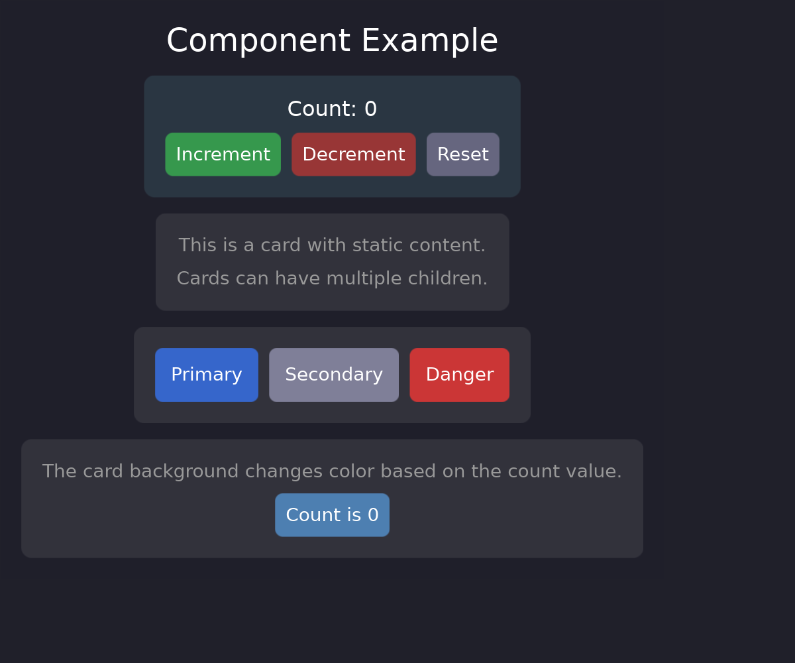

# Creating Components

The `#[component]` macro creates reusable widgets from functions. Function parameters become props, and the function body becomes the render method.



## Basic Component

```rust
use guido::prelude::*;

#[component]
pub fn button(label: String) -> impl Widget {
    container()
        .padding(12.0)
        .background(Color::rgb(0.3, 0.5, 0.8))
        .corner_radius(6.0)
        .hover_state(|s| s.lighter(0.1))
        .pressed_state(|s| s.ripple())
        .child(text(label.clone()).color(Color::WHITE))
}
```

Use the component with the auto-generated builder:

```rust
button().label("Click me")
```

The macro generates a `Button` struct (PascalCase) and a `button()` constructor function from the function name.

## Props

All function parameters are props. Use `#[prop(...)]` attributes for special behavior.

### Standard Props

Parameters without attributes become standard props with `Default::default()`:

```rust
#[component]
pub fn button(label: String) -> impl Widget {
    container().child(text(label.clone()))
}
```

```rust
button().label("Required")
```

### Props with Defaults

```rust
#[component]
pub fn button(
    label: String,
    #[prop(default = "Color::rgb(0.3, 0.3, 0.4)")]
    background: Color,
    #[prop(default = "8.0")]
    padding: f32,
) -> impl Widget {
    container()
        .padding(padding.get())
        .background(background.clone())
        .child(text(label.clone()).color(Color::WHITE))
}
```

Optional — uses default if not specified:

```rust
button().label("Uses defaults")
button().label("Custom").background(Color::RED).padding(16.0)
```

### Callback Props

```rust
#[component]
pub fn button(
    label: String,
    #[prop(callback)] on_click: (),
) -> impl Widget {
    container()
        .on_click_option(on_click.clone())
        .child(text(label.clone()))
}
```

Provide closures for events:

```rust
button()
    .label("Click me")
    .on_click(|| println!("Clicked!"))
```

## Accessing Props

In the function body, each prop is a reference to `&MaybeDyn<T>`. Use `.get()` to extract the current value, or `.clone()` to pass the whole `MaybeDyn<T>` to another widget method (preserving reactivity):

```rust
#[component]
pub fn button(
    label: String,
    #[prop(default = "8.0")] padding: f32,
    #[prop(default = "Color::rgb(0.3, 0.3, 0.4)")] background: Color,
    #[prop(callback)] on_click: (),
) -> impl Widget {
    container()
        .padding(padding.get())           // Extract value from MaybeDyn<f32>
        .background(background.clone())   // Pass MaybeDyn<Color> (keeps reactivity)
        .on_click_option(on_click.clone()) // Clone optional callback
        .child(text(label.clone()))
}
```

## Components with Children

```rust
#[component]
pub fn card(
    title: String,
    #[prop(children)] children: (),
) -> impl Widget {
    container()
        .padding(16.0)
        .background(Color::rgb(0.18, 0.18, 0.22))
        .corner_radius(8.0)
        .layout(Flex::column().spacing(8.0))
        .child(text(title.clone()).font_size(18.0).color(Color::WHITE))
        .children_source(children)
}
```

Use with child/children methods:

```rust
card()
    .title("My Card")
    .child(text("First child"))
    .child(text("Second child"))
```

## Slot Props

Slots let a component accept named widget positions — useful for layout components
like headers, sidebars, or multi-region containers:

```rust
#[component]
pub fn center_box(
    #[prop(slot)] left: (),
    #[prop(slot)] center: (),
    #[prop(slot)] right: (),
) -> impl Widget {
    container()
        .layout(Flex::row())
        .children(vec![
            left,
            center,
            right,
        ].into_iter().flatten())
}
```

Use with the auto-generated builder methods:

```rust
center_box()
    .left(text("Left"))
    .center(text("Center"))
    .right(text("Right"))
```

Each slot accepts any `impl Widget + 'static`. Inside the function body, use the parameter name
directly — it's an `Option<Box<dyn Widget>>` that was automatically consumed from the slot.

## Reactive Props

Props accept signals and closures:

```rust
let count = create_signal(0);

button()
    .label(move || format!("Count: {}", count.get()))
    .background(move || {
        if count.get() > 5 {
            Color::rgb(0.3, 0.8, 0.3)
        } else {
            Color::rgb(0.3, 0.5, 0.8)
        }
    })
```

## Complete Example

```rust
use guido::prelude::*;

#[component]
pub fn button(
    label: String,
    #[prop(default = "Color::rgb(0.3, 0.3, 0.4)")] background: Color,
    #[prop(default = "8.0")] padding: f32,
    #[prop(callback)] on_click: (),
) -> impl Widget {
    container()
        .padding(padding.get())
        .background(background.clone())
        .corner_radius(6.0)
        .hover_state(|s| s.lighter(0.1))
        .pressed_state(|s| s.ripple())
        .on_click_option(on_click.clone())
        .child(text(label.clone()).color(Color::WHITE))
}

#[component]
pub fn card(
    title: String,
    #[prop(default = "Color::rgb(0.18, 0.18, 0.22)")] background: Color,
    #[prop(children)] children: (),
) -> impl Widget {
    container()
        .padding(16.0)
        .background(background.get())
        .corner_radius(8.0)
        .layout(Flex::column().spacing(8.0))
        .child(text(title.clone()).font_size(18.0).color(Color::WHITE))
        .children_source(children)
}

fn main() {
    App::new().run(|app| {
        let count = create_signal(0);

        let view = container()
            .padding(16.0)
            .layout(Flex::column().spacing(12.0))
            .child(
                card()
                    .title("Counter")
                    .child(text(move || format!("Count: {}", count.get())).color(Color::WHITE))
                    .child(
                        container()
                            .layout(Flex::row().spacing(8.0))
                            .child(button().label("Increment").on_click(move || count.update(|c| *c += 1)))
                            .child(button().label("Reset").on_click(move || count.set(0)))
                    )
            );

        app.add_surface(
            SurfaceConfig::new()
                .width(400)
                .height(200)
                .background_color(Color::rgb(0.1, 0.1, 0.15)),
            move || view,
        );
    });
}
```

## When to Use Components

Components are ideal for:

- **Repeated patterns** - Buttons, cards, list items
- **Configurable widgets** - Same structure, different props
- **Encapsulated state** - Self-contained logic
- **Team collaboration** - Clear interfaces and contracts

For one-off layouts, regular functions returning `impl Widget` may be simpler.
