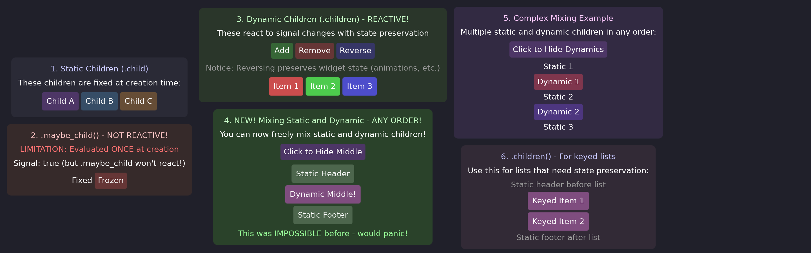

# Dynamic Children

Learn the different ways to add children to containers, from static to fully reactive with automatic resource cleanup.



## The Model

Children come in four forms — two static, two reactive, plus a keyed variant
for lists:

```rust
container()
    .child(text("Hello"))                                  // static single
    .child(move || build_menu(entries.get()))              // reactive single
    .children([text("A"), text("B")])                      // static list
    .children(move || build_rows(items.get()))             // reactive list
    .children(keyed(move || items.get(), |i| i.id, row))   // reactive keyed list
```

The rule is the one from SolidJS and Leptos: **a value is static, a closure
is reactive**. A reactive closure re-runs when a signal it reads changes,
and its result **replaces** the previous widget — always. There is no key
comparison and no silently discarded rebuild.

Tracking is per segment: each closure re-runs only when *its own* signals
change, never because a sibling changed.

## Reactive Single Child

```rust
// Content rebuilt when the data changes
container().child(move || build_menu(menu_entries.get()))

// Presence: Option shows/hides — None removes the child
container().child(move || {
    state.active_window.get().map(|w| title_widget(w))
})
```

Because widget properties are themselves lazy closures (a `text(move || ...)`
tracks its signal at paint time, not at construction), the reads tracked by a
child closure are naturally the **structural** ones: the closure re-runs
exactly when the shape of the content must change, while property-level
updates keep flowing through the widgets without any rebuild.

### Controlling granularity with memos

A closure re-runs whenever a tracked signal *changes value*. If your content
depends on a reduction of the data (a count, a filtered subset), read a memo
instead of the raw signal — memos notify only when the computed value
actually changes:

```rust
let count = create_memo(move || items.with(|l| l.len()));

// Rebuilt only when the count changes, not on every list edit
container().child(move || text(format!("{} items", count.get())))
```

## Reactive Lists

The unkeyed closure form replaces **all rows** when it re-runs:

```rust
container().children(move || {
    items.with(|list| {
        list.iter().map(|item| row_widget(item)).collect::<Vec<_>>()
    })
})
```

Rows have no identity across runs: inner state (hover, animations, local
signals) does not survive a re-run. That is fine for simple rows; for rows
that carry state, use `keyed()`:

```rust
container().children(keyed(
    move || items.get(),   // tracked; items: Clone + PartialEq
    |item| item.id,        // stable identity (survives reorders)
    |item| item_widget(item),
))
```

Per item, identity (`key`) and content (`PartialEq`) are diffed separately:

- **new key** → the builder runs
- **known key, item unchanged** → the existing widget is kept, including
  across reorders (state and animations persist)
- **known key, item changed** → only that row is rebuilt
- **key gone** → the widget is dropped with owner cleanup

Keys must be unique and stable — never use the index:

```rust
keyed(data, |item| item.id, build)          // Good: stable identity
keyed(data, |item| item.name.clone(), build) // Good: any Hash + Eq key
keyed(data, |(index, _)| *index, build)      // Bad: reorder loses state
```

The key is anything `Hash + Eq + Clone`, and rows are indexed by the key itself
rather than by a hash of it, so two distinct keys are never reconciled as one.

The item type chooses the update granularity: fields included in the item
trigger a row rebuild when they change; fields left out can be read via
signals inside the row for in-place updates.

## Automatic Ownership & Cleanup

Reactive closures and keyed builders run inside an **owner scope**: signals
and effects created there are automatically owned and cleaned up when the
child is removed or rebuilt.

```rust
fn item_widget(item: Item) -> impl Widget {
    // This signal is OWNED by this row
    let clicks = create_signal(0);

    // Register cleanup for non-reactive resources
    on_cleanup(move || {
        log::info!("Item {} removed", item.id);
    });

    container()
        .padding(8.0)
        .when_hovered(|s| s.lighter(0.1))
        .on_click(move || clicks.update(|c| *c += 1))
        .child(text(move || format!("{} (clicks: {})", item.name, clicks.get())))
}

container().children(keyed(move || items.get(), |i| i.id, item_widget))
```

When a child is removed or rebuilt:
1. The widget is dropped
2. `on_cleanup` callbacks run
3. Effects are disposed
4. Signals are disposed

State that must survive a rebuild belongs in signals created *outside* the
closure.

## Complete Example

```rust
#[derive(Clone, PartialEq)]
struct Item {
    id: u64,
    name: String,
}

fn dynamic_list_demo() -> impl Widget {
    let items = create_signal(vec![
        Item { id: 1, name: "First".into() },
        Item { id: 2, name: "Second".into() },
        Item { id: 3, name: "Third".into() },
    ]);
    let next_id = create_signal(4u64);

    container()
        .padding(16.0)
        .layout(Flex::column().spacing(12.0))
        .child(
            container()
                .layout(Flex::row().spacing(8.0))
                .children([
                    button("Add", move || {
                        let id = next_id.get();
                        next_id.set(id + 1);
                        items.update(|list| {
                            list.push(Item { id, name: format!("Item {}", id) });
                        });
                    }),
                    button("Remove Last", move || {
                        items.update(|list| { list.pop(); });
                    }),
                    button("Reverse", move || {
                        items.update(|list| { list.reverse(); });
                    }),
                ])
        )
        .child(
            container()
                .layout(Flex::column().spacing(4.0))
                .children(keyed(move || items.get(), |i| i.id, item_widget))
        )
}

fn button(label: &str, on_click: impl Fn() + 'static) -> Container {
    container()
        .padding(8.0)
        .background(Color::rgb(0.3, 0.3, 0.4))
        .corner_radius(4.0)
        .when_hovered(|s| s.lighter(0.1))
        .when_pressed(|s| s.ripple())
        .on_click(on_click)
        .child(container().child(text(label).color(Color::WHITE)))
}
```

## Mixing Static and Dynamic

Combine static and dynamic children freely, in any order:

```rust
container()
    .layout(Flex::column().spacing(8.0))
    // Static header
    .child(container().child(text("Items:").color(Color::WHITE)))
    // Reactive middle
    .child(move || warning.get().then(|| warning_banner()))
    // Reactive keyed list
    .children(keyed(move || items.get(), |i| i.id, item_view))
    // Static footer
    .child(container().child(text("End of list").font_size(18.0).color(Color::rgb(0.6, 0.6, 0.7))))
```

## API Reference

```rust
impl Container {
    // A widget value, or a reactive closure returning a widget / Option<widget>
    pub fn child<M>(self, child: impl IntoChild<M>) -> Self;

    // An iterator of widgets, a reactive closure returning one,
    // or keyed(data, key, build)
    pub fn children<M>(self, children: impl IntoChildren<M>) -> Self;
}

// Reactive keyed children list: tracked data, key-based identity,
// untracked per-item builder with content diffing.
pub fn keyed<T, I, K, W>(
    data: impl Fn() -> I + 'static,
    key: impl Fn(&T) -> K + 'static,
    build: impl Fn(T) -> W + 'static,
) -> KeyedChildren<T, I, K, W>
where
    T: Clone + PartialEq + 'static,
    I: IntoIterator<Item = T>,
    K: Hash + Eq + Clone + 'static,
    W: Widget + 'static;

// Cleanup registration (use inside reactive closures and builders)
pub fn on_cleanup(f: impl FnOnce() + 'static);
```
