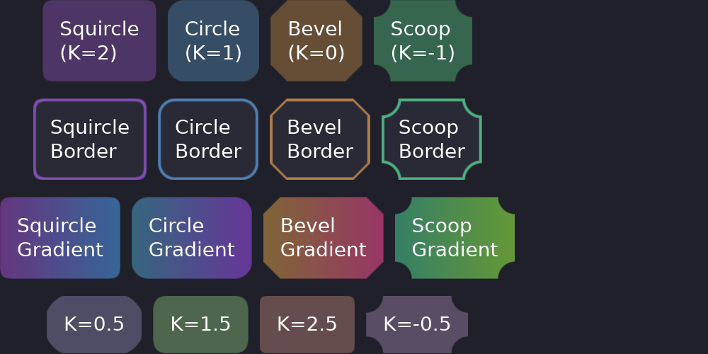

# Building UI

This section covers the visual styling options in Guido. Learn how to create polished, professional-looking interfaces.



## Styling Philosophy

Guido uses a **builder pattern** for styling - each method returns the widget, allowing chained calls:

```rust
container()
    .padding(16.0)
    .background(Color::rgb(0.2, 0.2, 0.3))
    .corners(8.0)
    .border(1.0, Color::WHITE)
```

All styling is done in Rust code, not external CSS files. This provides type safety and IDE support.

## In This Section

- [Styling Overview](styling.md) - Complete styling reference
- [Colors](colors.md) - Color creation and manipulation
- [Borders & Corners](borders.md) - Borders, corner radius, and curvature
- [Elevation & Shadows](elevation.md) - Material Design-style shadows
- [Text](text.md) - Text styling and typography

## Quick Reference

```rust
// Background
.background(Color::rgb(0.2, 0.2, 0.3))
.gradient(LinearGradient::horizontal(start, end))

// Corners
.corners(Corners::squircle(8.0))  // iOS-style smooth

// Border
.border(2.0, Color::WHITE)

// Shadow
.elevation(4.0)

// Spacing
.padding(16.0)
.padding([10.0, 20.0])   // [vertical, horizontal]

// Size
.width(100.0)
.height(50.0)
```
