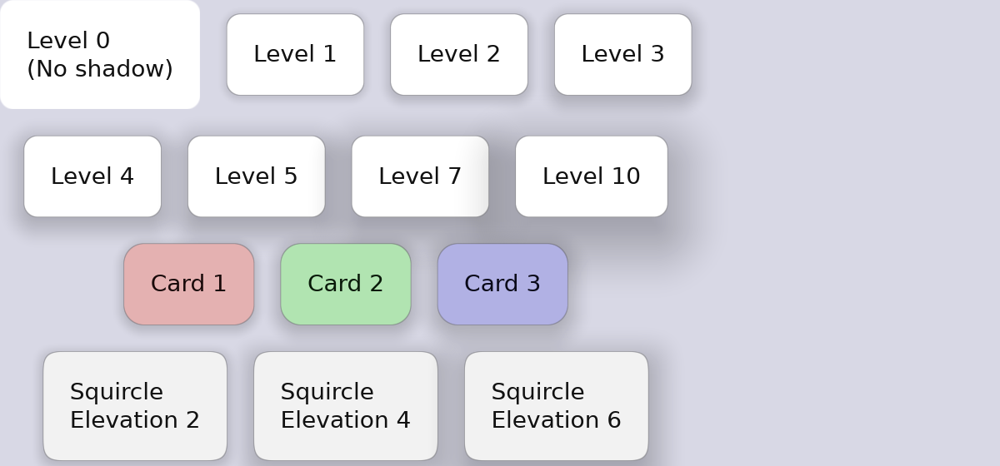

# Elevation & Shadows

Guido supports Material Design-style elevation shadows for creating depth and hierarchy.



## Basic Elevation

```rust
container().elevation(2.0)   // Subtle shadow
container().elevation(4.0)   // Light shadow
container().elevation(8.0)   // Medium shadow
container().elevation(12.0)  // Strong shadow
container().elevation(16.0)  // Very strong shadow
```

## How Elevation Works

Elevation creates a diffuse shadow beneath the container. Higher values create:
- Larger shadow spread
- Greater blur
- More noticeable depth effect

## Elevation in State Layers

Elevation can change on interaction for tactile feedback:

```rust
container()
    .elevation(2.0)
    .hover_state(|s| s.elevation(4.0))     // Lift on hover
    .pressed_state(|s| s.elevation(1.0))   // Press down on click
```

This creates a "lifting" effect on hover and a "pressing" effect on click.

## Animated Elevation

Smooth elevation transitions:

```rust
container()
    .elevation(2.0)
    .animate_elevation(Transition::new(200.0, TimingFunction::EaseOut))
    .hover_state(|s| s.elevation(6.0))
```

## Elevation with Corner Radius

Shadows respect corner radius:

```rust
container()
    .corner_radius(12.0)
    .squircle()
    .elevation(8.0)  // Shadow follows rounded shape
```

## Complete Example

```rust
fn elevated_card() -> Container {
    container()
        .width(200.0)
        .padding(20.0)
        .background(Color::rgb(0.15, 0.15, 0.2))
        .corner_radius(12.0)
        .elevation(4.0)
        .animate_background(Transition::new(150.0, TimingFunction::EaseOut))
        .animate_elevation(Transition::new(200.0, TimingFunction::EaseOut))
        .hover_state(|s| s.elevation(8.0).lighter(0.05))
        .pressed_state(|s| s.elevation(2.0).darker(0.05))
        .layout(Flex::column().spacing(8.0))
        .children([
            text("Card Title").font_size(18.0).bold().color(Color::WHITE),
            text("Card content goes here").color(Color::rgb(0.7, 0.7, 0.75)),
        ])
}
```

## Elevation Guidelines

### When to Use Elevation

- **Cards** - Content containers that need to stand out
- **Buttons** - Interactive elements, especially floating action buttons
- **Dialogs** - Modal windows that overlay content
- **Menus** - Dropdown menus and popups

### Elevation Levels

| Level | Use Case |
|-------|----------|
| 1-2 | Cards, list items |
| 3-4 | Buttons, small cards |
| 6-8 | App bars, snackbars |
| 12-16 | Dialogs, floating elements |

### Interaction Patterns

- **Hover**: Increase elevation by 2-4 levels
- **Pressed**: Decrease elevation by 1-2 levels (or to minimum)

```rust
container()
    .elevation(4.0)
    .hover_state(|s| s.elevation(8.0))    // +4 on hover
    .pressed_state(|s| s.elevation(2.0))  // -2 on press
```

## Elevation with Light/Dark Themes

On dark backgrounds, elevation is subtle but effective. Pair with slight background lightening for better visibility:

```rust
container()
    .background(Color::rgb(0.12, 0.12, 0.16))
    .elevation(4.0)
    .hover_state(|s| s.elevation(8.0).lighter(0.03))
```
