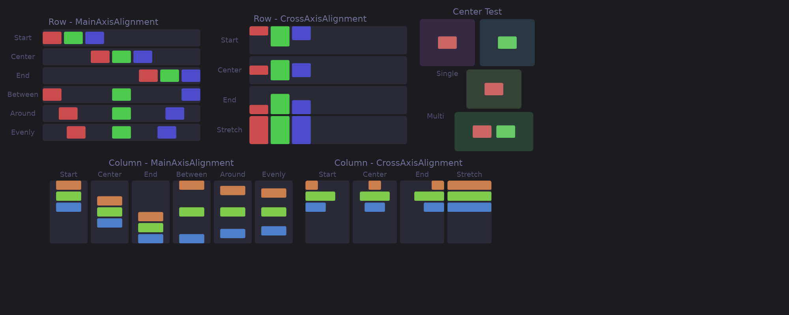

# Layout

Guido uses a flexbox-style layout system for arranging widgets. The `Flex` layout handles rows and columns with spacing and alignment options.



## Basic Layout

### Row (Horizontal)

```rust
container()
    .layout(Flex::row())
    .children([
        text("Left"),
        text("Center"),
        text("Right"),
    ])
```

### Column (Vertical)

```rust
container()
    .layout(Flex::column())
    .children([
        text("Top"),
        text("Middle"),
        text("Bottom"),
    ])
```

## Spacing

Add space between children:

```rust
container()
    .layout(Flex::row().spacing(8.0))
    .children([...])
```

## Main Axis Alignment

Control distribution along the layout direction:

```rust
Flex::row().main_alignment(MainAlignment::Center)
```

### Options

| Alignment | Description |
|-----------|-------------|
| `Start` | Pack at the beginning |
| `Center` | Center in available space |
| `End` | Pack at the end |
| `SpaceBetween` | Equal space between, none at edges |
| `SpaceAround` | Equal space around each item |
| `SpaceEvenly` | Equal space including edges |

### Visual Examples

```
Start:        [A][B][C]
Center:          [A][B][C]
End:                      [A][B][C]
SpaceBetween: [A]      [B]      [C]
SpaceAround:   [A]    [B]    [C]
SpaceEvenly:    [A]   [B]   [C]
```

## Cross Axis Alignment

Control alignment perpendicular to the layout direction:

```rust
Flex::row().cross_alignment(CrossAlignment::Center)
```

### Options

| Alignment | Description |
|-----------|-------------|
| `Start` | Align to start of cross axis |
| `Center` | Center on cross axis |
| `End` | Align to end of cross axis |
| `Stretch` | Stretch to fill cross axis |
| `Baseline` | Line children up on the baseline of their text |

### Baseline

Text of different sizes in a row does not read as one line when the tops are
aligned — a 24px label and a 12px one float at unrelated heights. `Baseline`
puts them on the line they are written on:

```rust
container()
    .layout(Flex::row().spacing(8.0).cross_alignment(CrossAlignment::Baseline))
    .children([
        container().font_size(24.0).child(text("28")),
        container().font_size(12.0).child(text("°C")),
    ])
```

A box reports no baseline of its own, so it is aligned by its bottom edge,
which is what CSS does with it. A container takes the baseline of its
content, so wrapping a text for styling does not lose the alignment. In a
column there is no shared line to sit on, and `Baseline` behaves as `Start`.

### Visual Example (Row)

```
Start:    ┌───┐┌─┐┌──┐
          │ A ││B││ C│
          └───┘│ │└──┘
               └─┘

Center:        ┌─┐
          ┌───┐│B│┌──┐
          │ A │└─┘│ C│
          └───┘   └──┘

End:           ┌─┐
               │B│
          ┌───┐└─┘┌──┐
          │ A │   │ C│
          └───┘   └──┘

Stretch:  ┌───┐┌─┐┌──┐
          │   ││ ││  │
          │ A ││B││ C│
          │   ││ ││  │
          └───┘└─┘└──┘
```

## Complete Example

```rust
container()
    .layout(
        Flex::row()
            .spacing(16.0)
            .main_alignment(MainAlignment::SpaceBetween)
            .cross_alignment(CrossAlignment::Center)
    )
    .padding(20.0)
    .children([
        container().font_size(24.0).child(text("Left")),
        container()
            .layout(Flex::column().spacing(4.0))
            .children([
                text("Center"),
                text("Items"),
            ]),
        container().font_size(24.0).child(text("Right")),
    ])
```

## Nested Layouts

Combine rows and columns for complex layouts:

```rust
container()
    .layout(Flex::column().spacing(16.0))
    .children([
        // Header row
        container()
            .layout(Flex::row().main_alignment(MainAlignment::SpaceBetween))
            .children([
                text("Logo"),
                text("Menu"),
            ]),
        // Content row
        container()
            .layout(Flex::row().spacing(16.0))
            .children([
                sidebar(),
                main_content(),
            ]),
        // Footer row
        container()
            .layout(Flex::row().main_alignment(MainAlignment::Center))
            .child(text("Footer")),
    ])
```

## Size Constraints

Control how children size within layouts:

### Fixed Size

```rust
container()
    .width(200.0)
    .height(100.0)
```

### Minimum/Maximum

```rust
container()
    .min_width(100.0)
    .max_width(300.0)
```

### At Least

Request at least a certain size:

```rust
container()
    .width(at_least(200.0))  // At least 200px, can grow
```

### Fill Available Space

Make a container expand to fill all available space:

```rust
container()
    .height(fill())  // Fills available height
    .width(fill())   // Fills available width
```

This is particularly useful for root containers that should fill their surface, or for creating layouts where children are centered within the full available space:

```rust
container()
    .height(fill())
    .layout(
        Flex::row()
            .main_alignment(MainAlignment::Center)
            .cross_alignment(CrossAlignment::Center)
    )
    .child(text("Centered in available space"))
```

## Layout Without Explicit Flex

Containers without `.layout()` use `Flex::column()`:

```rust
// Same as .layout(Flex::column())
container()
    .children([
        text("first"),
        text("second"),
    ])
```

## Stacking Children (ZStack)

`ZStack` places every child at the same position, stacked along the Z axis —
later children paint on top:

```rust
container()
    .layout(ZStack::new())
    .child(background())
    .child(content())   // drawn on top
```

### Leaders and Followers

The stack takes the size of its largest child, but a child that declares
`fill()` on an axis **follows** the stack instead of leading it: it never
contributes to that axis and is laid out against the size the other children
established.

That is how a decoration is sized to its sibling without measuring anything:

```rust
container()
    .layout(ZStack::new())
    // Follower: exactly as wide and tall as the card below it
    .child(
        container()
            .width(fill())
            .height(fill())
            .background(Color::rgb(0.2, 0.2, 0.3))
    )
    // Leader: the stack is as big as this card
    .child(card_content())
```

Without this rule the background would expand to all the available space,
and sizing it to its sibling would need a [WidgetRef](../advanced/widget-ref.md)
round-trip — one frame behind, and zero on the first frame.

The two axes are decided independently, which is what makes the status-bar
case work: a child with only `.height(fill())` fills the bar height and still
leads the width.

```rust
container()
    .height(fill())
    .layout(ZStack::new())
    // Follows both axes
    .child(container().width(fill()).height(fill()).child(visualizer()))
    // Fills the bar height, leads the width
    .child(container().height(fill()).child(now_playing()))
```

When *every* child fills an axis there is no size to follow, and the stack
takes all the space it was offered on that axis.

### Positioning Inside the Stack

Every child sits at the stack's origin. To place a follower elsewhere, let it
fill both axes and use its own layout:

```rust
container()
    .layout(ZStack::new())
    .child(icon_widget())
    // Alert dot pinned to the icon's top-right corner
    .child(
        container()
            .width(fill())
            .height(fill())
            .layout(Flex::row().main_alignment(MainAlignment::End))
            .child(
                container()
                    .width(4)
                    .height(4)
                    .corner_radius(2)
                    .background(Color::RED)
            )
    )
```

## API Reference

### Flex Builder

```rust
Flex::row() -> Flex                    // Horizontal layout
Flex::column() -> Flex                 // Vertical layout
.spacing(f32) -> Flex                  // Space between children
.main_alignment(MainAlignment) -> Flex
.cross_alignment(CrossAlignment) -> Flex
```

### MainAlignment

```rust
MainAlignment::Start
MainAlignment::Center
MainAlignment::End
MainAlignment::SpaceBetween
MainAlignment::SpaceAround
MainAlignment::SpaceEvenly
```

### CrossAlignment

```rust
CrossAlignment::Start
CrossAlignment::Center
CrossAlignment::End
CrossAlignment::Stretch
```

### ZStack

```rust
ZStack::new() -> ZStack                // Children stacked at the same origin
```
