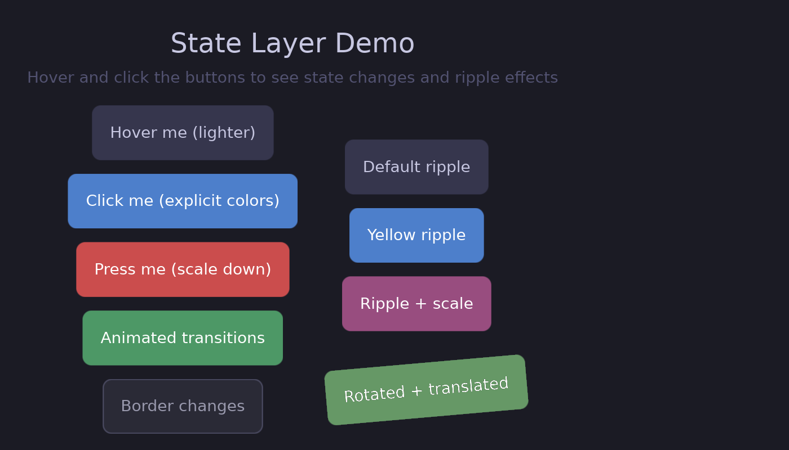
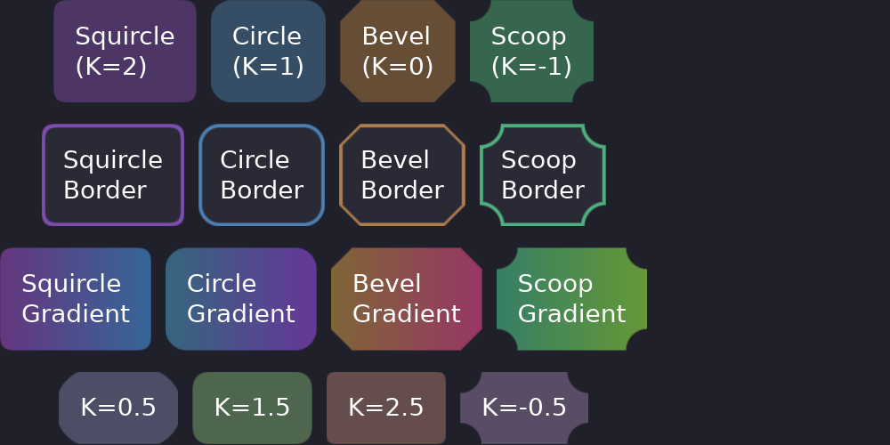
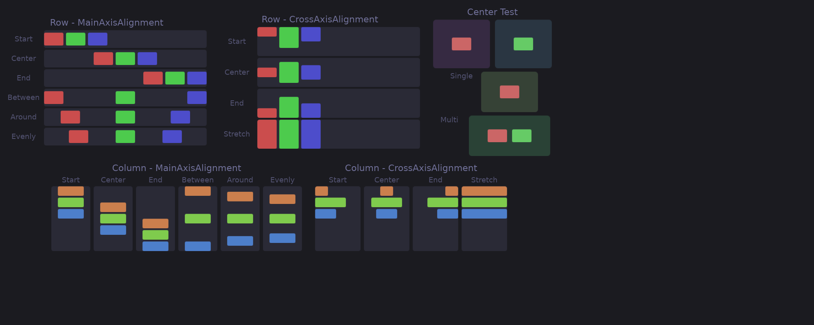

# Running Examples

Guido includes several examples that demonstrate different features. Clone the repository and run them to see the library in action.

## Getting the Examples

```bash
git clone https://github.com/zibo/guido.git
cd guido
```

## Running an Example

```bash
cargo run --example <example_name>
```

## Available Examples

### status_bar

A simple status bar demonstrating basic layout and containers.

```bash
cargo run --example status_bar
```


**Features demonstrated:**
- Horizontal flex layout with `SpaceBetween` alignment
- Container backgrounds and corner radius
- Text widgets

---

### reactive_example

Interactive example showing the reactive system.

```bash
cargo run --example reactive_example
```


**Features demonstrated:**
- Signals and reactive text
- Click handlers with `on_click`
- Scroll handlers with `on_scroll`
- Background thread updates
- State layer hover effects
- Borders and gradients

---

### state_layer_example

Comprehensive demonstration of the state layer API.

```bash
cargo run --example state_layer_example
```



**Features demonstrated:**
- Hover states with `lighter()` and explicit colors
- Pressed states with transforms
- Animated transitions
- Border animations
- Ripple effects (default, colored, with scale)
- Transformed containers with ripples

---

### animation_example

Animated properties with spring physics.

```bash
cargo run --example animation_example
```


**Features demonstrated:**
- Width animation with spring physics
- Color animation with easing
- Combined animations
- Border animation

---

### transform_example

The 2D transform system.

```bash
cargo run --example transform_example
```


**Features demonstrated:**
- Static rotation and scale
- Click-to-rotate with animation
- Spring-based scale animation
- Transform origins (pivot points)
- Nested transforms

---

### showcase

Corner curvature variations using superellipse rendering.

```bash
cargo run --example showcase
```



**Features demonstrated:**
- Squircle corners (iOS-style, K=2)
- Circular corners (default, K=1)
- Beveled corners (K=0)
- Scooped/concave corners (K=-1)
- Borders and gradients with different curvatures

---

### flex_layout_test

All flex layout alignment options.

```bash
cargo run --example flex_layout_test
```



**Features demonstrated:**
- `MainAxisAlignment`: Start, Center, End, SpaceBetween, SpaceAround, SpaceEvenly
- `CrossAxisAlignment`: Start, Center, End, Stretch
- Row and column layouts

---

### component_example

Creating reusable components with the `#[component]` macro.

```bash
cargo run --example component_example
```


**Features demonstrated:**
- `#[component]` macro for reusable widgets
- Component props and signals
- Stateful components with internal signals
- Composition of components

---

### children_example

Dynamic children and child management patterns.

```bash
cargo run --example children_example
```


**Features demonstrated:**
- `.child()` for single children
- `.children([...])` for multiple children
- `.maybe_child()` for conditional rendering
- `.children_dyn()` for reactive lists

---

### elevation_example

Material Design-style elevation shadows.

```bash
cargo run --example elevation_example
```


**Features demonstrated:**
- Different elevation levels (2, 4, 8, 12, 16)
- Elevation changes on hover/press
- Animated elevation transitions

---

### image_example

Displaying raster and SVG images.

```bash
cargo run --example image_example
```

**Features demonstrated:**
- PNG/WebP raster images
- SVG vector images
- ContentFit modes (Contain, Cover, Fill)
- Images with transforms

---

### scroll_example

Scrollable containers with customizable scrollbars.

```bash
cargo run --example scroll_example
```

**Features demonstrated:**
- Vertical and horizontal scrolling
- Custom scrollbar styling (colors, width, radius)
- Hidden scrollbars
- Kinetic/momentum scrolling

---

### scroll_mixed_content

Advanced scrollable container with mixed content types.

```bash
cargo run --example scroll_mixed_content
```

**Features demonstrated:**
- Text widgets inside scrollable containers
- Text input widgets with form fields
- Raster and SVG images in scrollable content
- Interactive elements with hover states and ripples
- Vertical and horizontal scrolling together
- Scrollbar customization with different styles

---

### multi_surface

Multiple surfaces with shared reactive state.

```bash
cargo run --example multi_surface
```

**Features demonstrated:**
- Creating multiple layer shell surfaces
- Shared reactive signals between surfaces
- Independent surface configuration

---

### surface_properties_example

Dynamic surface property modification at runtime.

```bash
cargo run --example surface_properties_example
```

**Features demonstrated:**
- Changing layer at runtime
- Modifying keyboard interactivity
- Adjusting anchor and size dynamically

---

### text_input_example

Text input widgets with editing capabilities.

```bash
cargo run --example text_input_example
```

**Features demonstrated:**
- Single and multiline text input
- Cursor and selection styling
- Placeholder text
- Focus states

## Exploring the Code

Each example's source code is in the `examples/` directory. Reading through them is a great way to learn Guido patterns:

```bash
# View an example's source
cat examples/reactive_example.rs
```

## Next Steps

After exploring the examples, dive deeper into the concepts:

- [Core Concepts](../concepts/README.md) - Understand the reactive model
- [Building UI](../building-ui/README.md) - Master styling and layout
- [Interactivity](../interactivity/README.md) - Add hover states and events

---

### service_example

Background services with automatic cleanup.

```bash
cargo run --example service_example
```

**Features demonstrated:**
- `create_service` for background threads
- Bidirectional communication with commands
- Read-only services for periodic updates
- Automatic cleanup when component unmounts
