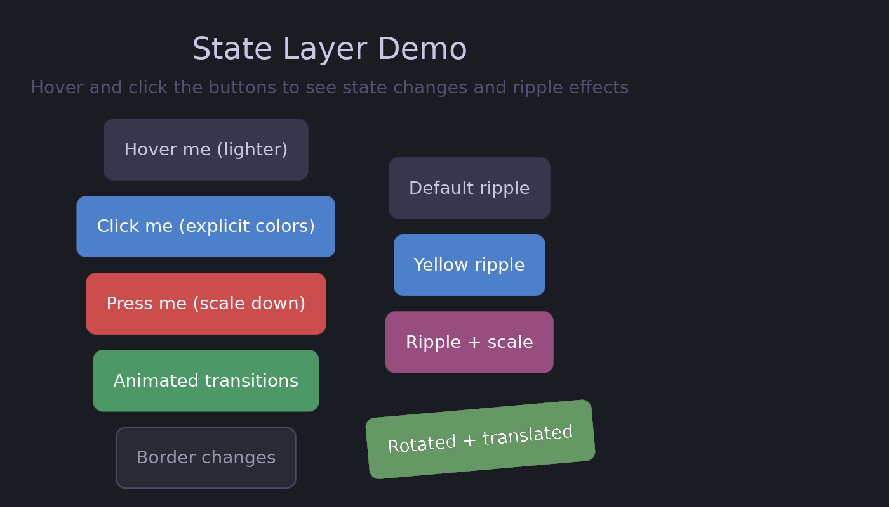

# Interactivity

This section covers how to make your UI respond to user input with visual feedback.



## The State Layer API

Guido uses a declarative **state layer** system for interaction feedback. Instead of manually managing hover states with signals, you declare what should change:

```rust
# extern crate guido;
# use guido::prelude::*;
# fn main() {
container()
    .background(Color::rgb(0.2, 0.2, 0.3))
    .when_hovered(|s| s.lighter(0.1))      // Lighten on hover
    .when_pressed(|s| s.ripple())         // Ripple on press
# ;
# }
```

The framework handles:
- State tracking (hover, pressed)
- Animations between states
- Ripple effect rendering
- Transform hit testing

## In This Section

- [State Layer API](state-layer.md) - Overview of the state layer system
- [Hover & Pressed States](states.md) - Define visual overrides per state
- [Disabling a Subtree](disabled.md) - Stop a whole subtree taking input, and style it
- [Ripple Effects](ripples.md) - Material Design-style touch feedback
- [Event Handling](events.md) - Click, hover, and scroll events

## Why State Layers?

Before state layers, creating hover effects required manual signal management:

```rust
# extern crate guido;
# use guido::prelude::*;
# fn main() {
// Old way (tedious)
let bg_color = create_signal(Color::rgb(0.2, 0.2, 0.3));
container()
    .background(bg_color)
    .on_hover(move |hovered| {
        if hovered {
            bg_color.set(Color::rgb(0.3, 0.3, 0.4));
        } else {
            bg_color.set(Color::rgb(0.2, 0.2, 0.3));
        }
    })
# ;
# }
```

With state layers:

```rust
# extern crate guido;
# use guido::prelude::*;
# fn main() {
// New way (clean)
container()
    .background(Color::rgb(0.2, 0.2, 0.3))
    .when_hovered(|s| s.lighter(0.1))
# ;
# }
```

Benefits:
- Less boilerplate code
- No manual signal management
- Built-in animation support
- Ripple effects included
